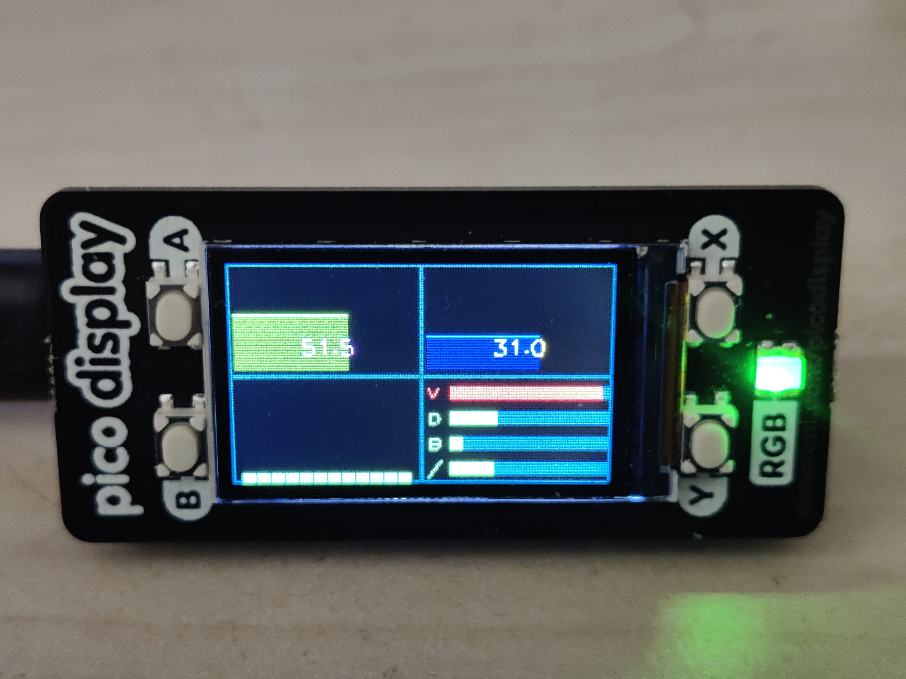

PiCoMonitor
-----------

# Introduction



Rasberry pico (w) based pc monitoring. Use pico display pack from Pimoroni [https://pimoroni.com/displaypack].

Feed by a Python script using psutil + serial.
Transmission of data over USB serial is done by JSON data (see [exemple.json](exemple.json) )

**PiCoMonitor.py** python script support Linux and Windows (need psutil, pyserial, pystray).
CPU Temp is not supported on Windows yet.
This script need to be modified to fit your hardware/software configuration.

# Compilation
Needs:
- [pico-sdk](https://github.com/raspberrypi/pico-sdk)
- The `third_party/pico-toolset` git submodule (display/touch/SD drivers,
  shared with this author's other Pico projects): `git submodule update --init`

```
$ git submodule update --init
$ mkdir build
$ cd build
$ cmake -DPICO_BOARD=pico_w ..
$ make
```

Useful options (no other dependency is needed for either board): `-DPICO_BOARD=pico` (plain Pico/RP2040, default `pico_w`),
`-DWITH_PICODISPLAY=ON -DWITH_CROWPANEL=OFF` (Pimoroni Pico Display Pack instead of the
default Elecrow CrowPanel).

## Build outputs
Each build produces two firmware images:

| File | For |
|------|-----|
| `PiCoMonitor.uf2` / `.bin` | Normal firmware, linked at `0x10000000`: copy the `.uf2` to the Pico (BOOTSEL) |
| `PiCoMonitor.picoboot.bin` (+ `.picoboot.uf2`) | Same firmware linked into the [PicoBoot](../PicoBoot) bootloader's application partition (`0x10080000`): put the **`.bin`** on PicoBoot's SD card |

The PicoBoot image needs a PicoBoot checkout (default `../PicoBoot`, override with
`-DPICOBOOT_DIR=...`); if it is not found the build warns and skips it. Other options:
`-DPICOBOOT_FLASH_SIZE=<bytes>` (board flash size, default 2 MiB: CrowPanel, Pico, Pico W) and
`-DWITH_PICOBOOT=OFF` to disable it.

### `install_firmware` target
```
$ make install_firmware
```
builds everything and copies every `.bin` / `.uf2` to `install/` (git-ignored), renamed with
the options of that build (`<display>-<PICO_BOARD>-<build type>`), so several variants can sit
side by side:

```
install/PiCoMonitor-crowpanel-pico-Release.uf2
install/PiCoMonitor-crowpanel-pico-Release.picoboot.bin
install/PiCoMonitor-picodisplay-pico_w-Release.uf2
...
```

# Pages and controls
The display has up to four pages; the extra ones appear automatically the first time the host sends the
matching data (an older host script, or a machine without e.g. a GPU, simply never shows them):

| Page | Content |
|------|---------|
| Overview | RAM and temperature graphs, per-core CPU bars, disk usage bars |
| Network | download / upload and disk read / write throughput graphs (auto-scaled) |
| System | CPU frequency, core count, load average, swap, uptime |
| GPU | GPU load, temperature, VRAM graphs and name (NVIDIA anywhere with the driver, AMD on Linux) |

Both boards use the same four corner controls:

| Corner | Action |
|--------|--------|
| top-left | backlight up (hold to repeat) |
| bottom-left | backlight down (hold to repeat) |
| top-right | previous page |
| bottom-right | next page |

On the Pimoroni Pico Display these are the buttons A (top-left), B (bottom-left), X (top-right), Y (bottom-right);
on the CrowPanel touch the outer third of the screen in that corner. The page name is shown briefly after a switch.
The Pico Display's RGB LED shows the overall status (green / orange / red; orange blinking = no signal).

# Host script
`host_script/PiCoMonitor.py` finds the Pico by itself (USB id), on Windows, Ubuntu and Raspberry Pi OS:
```
$ python host_script/PiCoMonitor.py                # auto-detect the port
$ python host_script/PiCoMonitor.py --list-ports   # show serial ports / what was detected
$ python host_script/PiCoMonitor.py -p COM3        # or /dev/ttyACM0: force a port
$ python host_script/PiCoMonitor.py --no-tray      # headless (servers, Raspberry Pi OS Lite)
```
On Linux your user needs access to the serial device: `sudo usermod -aG dialout $USER` (log in again).
CPU temperature works out of the box on Linux (Intel, AMD, Raspberry Pi); on Windows it needs
OpenHardwareMonitor (`host_script/OpenHardwareMonitor/` or `PICOMONITOR_OHM_DLL`).

# Installation
- Copy uf2 file to the pico or use picotool: 
```
sudo picotool load -f -x PiCoMonitor.uf2 
```
- When launched, start `host_script/PiCoMonitor.py` on the host to monitor.

